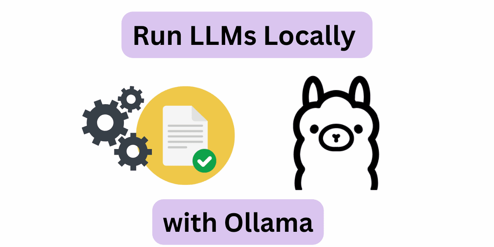

# Ollama 简介

Ollama 是一个开源的大型语言模型（LLM）平台，旨在让用户能够轻松地在本地运行、管理和与大型语言模型进行交互。

Ollama 提供了一个简单的方式来加载和使用各种预训练的语言模型，支持文本生成、翻译、代码编写、问答等多种自然语言处理任务。

Ollama 的特点在于它不仅仅提供了现成的模型和工具集，还提供了方便的界面和 API，使得从文本生成、对话系统到语义分析等任务都能快速实现。

与其他 NLP 框架不同，Ollama 旨在简化用户的工作流程，使得机器学习不再是只有深度技术背景的开发者才能触及的领域。

Ollama 支持多种硬件加速选项，包括纯 CPU 推理和各类底层计算架构（如 Apple Silicon），能够更好地利用不同类型的硬件资源。

## 核心功能与特点
### 多种预训练语言模型支持
Ollama 提供了多种开箱即用的预训练模型，包括常见的 GPT、BERT 等大型语言模型。用户可以轻松加载并使用这些模型进行文本生成、情感分析、问答等任务。

### 易于集成和使用
Ollama 提供了命令行工具（CLI）和 Python SDK，简化了与其他项目和服务的集成。开发者无需担心复杂的依赖或配置，可以快速将 Ollama 集成到现有的应用中。

### 本地部署与离线使用
不同于一些基于云的 NLP 服务，Ollama 允许开发者在本地计算环境中运行模型。这意味着可以脱离对外部服务器的依赖，保证数据隐私，并且对于高并发的请求，离线部署能提供更低的延迟和更高的可控性。

### 支持模型微调与自定义
用户不仅可以使用 Ollama 提供的预训练模型，还可以在此基础上进行模型微调。根据自己的特定需求，开发者可以使用自己收集的数据对模型进行再训练，从而优化模型的性能和准确度。

### 性能优化
Ollama 关注性能，提供了高效的推理机制，支持批量处理，能够有效管理内存和计算资源。这让它在处理大规模数据时依然保持高效。

### 跨平台支持
Ollama 支持在多个操作系统上运行，包括 Windows、macOS 和 Linux。这样无论是开发者在本地环境调试，还是企业在生产环境部署，都能得到一致的体验。

### 开放源码与社区支持
Ollama 是一个开源项目，这意味着开发者可以查看源代码，进行修改和优化，也可以参与到项目的贡献中。此外，Ollama 有一个活跃的社区，开发者可以从中获取帮助并与其他人交流经验。

## 应用场景
### 内容创作：
帮助作家、记者、营销人员快速生成高质量的内容，例如博客文章、广告文案等。

### 编程辅助：：
帮助开发者生成代码、调试程序或优化代码结构。

### 教育和研究：
辅助学生和研究人员进行学习、写作和研究，例如生成论文摘要或解答问题。

### 跨语言交流：
提供高质量的翻译功能，帮助用户打破语言障碍。

### 个人助手：
作为一个智能助手，帮助用户完成日常任务，例如撰写邮件、生成待办事项等。

## Ollama 与其他 LLM 的区别
|区别维度	| Ollama 的特点	| 说明 |
|---- |---- |---- |
|本地化	|更注重本地运行 | 与 ChatGPT 等依赖云服务的 LLM 不同，适合对数据隐私要求较高的用户 |
|灵活性	|可加载不同模型	| 用户可以根据需要加载不同的模型，而无需局限于单一的模型 |
|开源	|开源项目 |	用户可以自由地修改和扩展其功能 |

