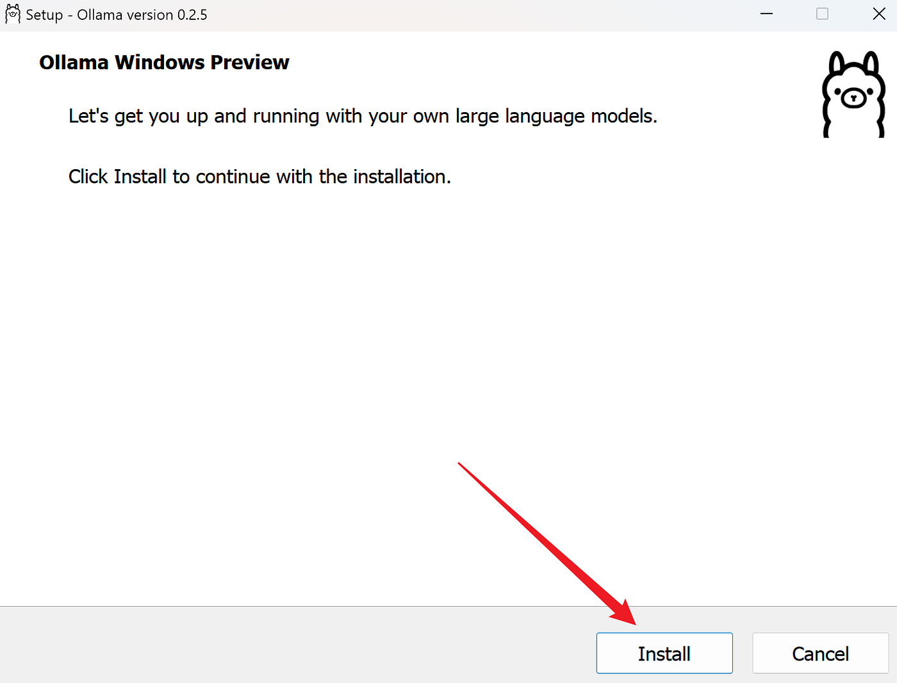

## Ollama 安装
Ollama 支持多种操作系统，包括 macOS、Windows、Linux 以及通过 Docker 容器运行。

Ollama 对硬件要求不高，旨在让用户能够轻松地在本地运行、管理和与大型语言模型进行交互。

- CPU：多核处理器（推荐 4 核或以上）。
- GPU：如果你计划运行大型模型或进行微调，推荐使用具有较高计算能力的 GPU（如 NVIDIA 的 CUDA 支持）。
- 内存：至少 8GB RAM，运行较大模型时推荐 16GB 或更高。
- 存储：需要足够的硬盘空间来存储预训练模型，通常需要 10GB 至数百 GB 的空间，具体取决于模型的大小。
- 软件要求：确保系统上安装了最新版本的 Python（如果打算使用 Python SDK）。

Ollama 官方下载地址：https://ollama.com/download。


我们可以根据不同的系统下载对应的包。

## 1、Windows 系统安装
打开浏览器，访问 Ollama 官方网站：https://ollama.com/download，下载适用于 Windows 的安装程序。

下载地址为：https://ollama.com/download/OllamaSetup.exe。

下载完成后，双击安装程序并按照提示完成安装。



### 验证安装
打开命令提示符或 PowerShell，输入以下命令验证安装是否成功：
```
ollama --version
```
如果显示版本号，则说明安装成功。

更改安装路径（可选）
如果需要将 Ollama 安装到非默认路径，可以在安装时通过命令行指定路径，例如：
```
OllamaSetup.exe /DIR="d:\some\location"
```
这样可以将 Ollama 安装到指定的目录。

## 2、macOS 系统安装
打开浏览器，访问 Ollama 官方网站：https://ollama.com/download，下载适用于 macOS 的安装程序。

下载地址为：https://ollama.com/download/Ollama-darwin.zip。

下载完成后，双击安装包并按照提示完成安装。

安装完成后，通过以下命令验证：
```
ollama --version
```
如果显示版本号，则说明安装成功。

## 3、Linux 系统安装
Linux 下可以使用一键安装脚本，我们打开终端，运行以下命令：
```shell
curl -fsSL https://ollama.com/install.sh | bash
```
安装完成后，通过以下命令验证：
```
ollama --version
```
如果显示版本号，则说明安装成功。


## 4、Docker 安装
如果你熟悉 Docker，也可以通过 Docker 安装 Ollama。

官方 Docker 镜像 ollama/ollama 可在 Docker Hub 上获取：https://hub.docker.com/r/ollama/ollama。

拉取 Docker 镜像：
```
docker pull ollama/ollama
```
运行容器：
```
docker run -p 11434:11434 ollama/ollama
```
访问 http://localhost:11434 即可使用 Ollama。
