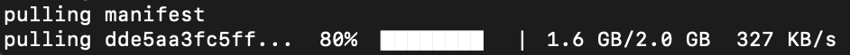

# Ollama 运行模型使用 ollama run 命令。

例如我们要运行 Llama 3.2 并与该模型对话可以使用以下命令：
```
ollama run llama3.2
```
执行以上命令如果没有该模型会去下载 llama3.2 模型：



等待下载完成后，我们在终端中，输入以下命令来加载 LLama3.2 模型并进行交互：

```
writing manifest 
success 
>>> 你好
Hello

>>> 能讲中文吗
是的，我可以在 Chinese 中对話。哪些话题或问题想要了解我呢？
```

结束对话可以输入 /bye 或按 Ctrl+d 按键来结束。

我们可以使用 ollama list，查看已安装的模型：
```
NAME           ID              SIZE      MODIFIED      
llama3.2    baf6a787fdff    1.3 GB    4 minutes ago  
```

## Ollama 支持的模型
Ollama 支持的模型可以访问：https://ollama.com/library


下表列出一些模型的下载命令：

| 模型|	参数	|大小	|下载命令|
| ---- | ---- | ---- | ---- |
| Llama 3.3	| 70B	| 43GB| 	ollama run llama3.3| 
| Llama 3.2	| 3B	| 2.0GB	| ollama run llama3.2| 
| Llama 3.2	| 1B	| 1.3GB	| ollama run llama3.2:1b| 
| Llama 3.2 Vision	| 11B	| 7.9GB	| ollama run llama3.2-vision| 
| Llama 3.2 Vision| 	90B	| 55GB| 	ollama run llama3.2-vision:90b| 
| Llama 3.1	| 8B	| 4.7GB	| ollama run llama3.1| 
| Llama 3.1	| 405B	| 231GB	| ollama run llama3.1:405b| 
| Phi 4	| 14B	| 9.1GB	| ollama run phi4| 
| Phi 3 Mini| 	3.8B	| 2.3GB| 	ollama run phi3| 
| Gemma 2| 	2B	| 1.6GB	| ollama run gemma2:2b| 
| Gemma 2	| 9B	| 5.5GB	| ollama run gemma2| 
| Gemma 2	| 27B| 	16GB	| ollama run gemma2:27b| 
| Mistral	| 7B	| 4.1GB	| ollama run mistral| 
| Moondream 2	| 1.4B	| 829MB	| ollama run moondream| 
| Neural Chat	| 7B	| 4.1GB	| ollama run neural-chat| 
| Starling	| 7B| 4.1GB	| ollama run starling-lm| 
| Code Llama| 	7B	| 3.8GB| 	ollama run codellama| 
| Llama 2 Uncensored| 	7B	| 3.8GB| 	ollama run llama2-uncensored| 
| LLaVA	| 7B	| 4.5GB	| ollama run llava| 
| Solar	| 10.7B	| 6.1GB	| ollama run solar| 


# 通过 Python SDK 使用模型
如果你希望将 Ollama 与 Python 代码集成，可以使用 Ollama 的 Python SDK 来加载和运行模型。

## 1. 安装 Python SDK
首先，需要安装 Ollama 的 Python SDK，打开终端，执行以下命令：
```
pip install ollama
```
## 2. 编写 Python 脚本
接下来，你可以使用 Python 代码来加载和与模型交互。

以下是一个简单的 Python 脚本示例，演示如何使用 LLama3.2 模型来生成文本：

实例
```python
import ollama
response = ollama.generate(
    model="llama3.2",  # 模型名称
    prompt="你是谁。"  # 提示文本
)
print(response)
```
## 3. 运行 Python 脚本
在终端中运行你的 Python 脚本：
```
python test.py
```
你会看到模型根据你的输入返回的回答。

## 4.对话模式
实例
```python
from ollama import chat
response = chat(
    model="llama3.2",
    messages=[
        {"role": "user", "content": "为什么天空是蓝色的？"}
    ]
)
print(response.message.content)
```
此代码会与模型进行对话，并打印模型的回复。

## 5. 流式响应
实例
```python
from ollama import chat
stream = chat(
    model="llama3.2",
    messages=[{"role": "user", "content": "为什么天空是蓝色的？"}],
    stream=True
)
for chunk in stream:
    print(chunk["message"]["content"], end="", flush=True)
```
此代码会以流式方式接收模型的响应，适用于处理大数据