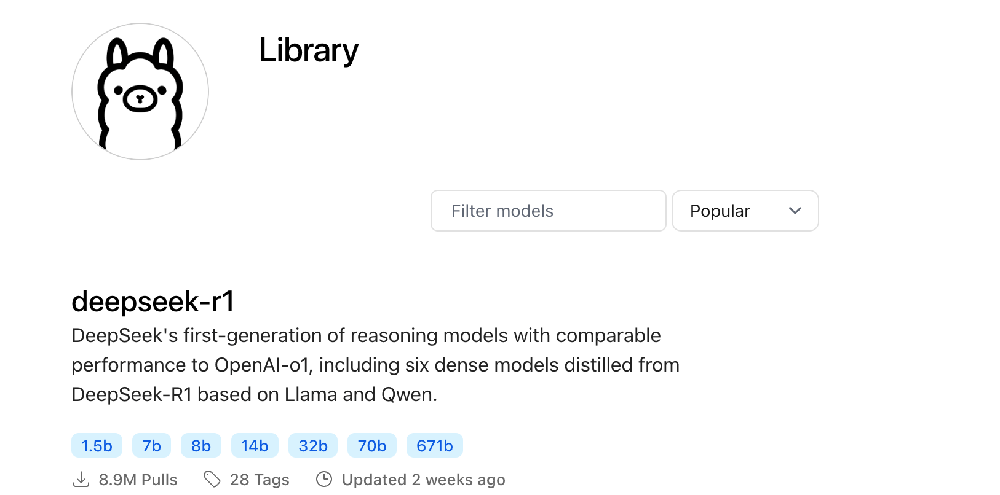
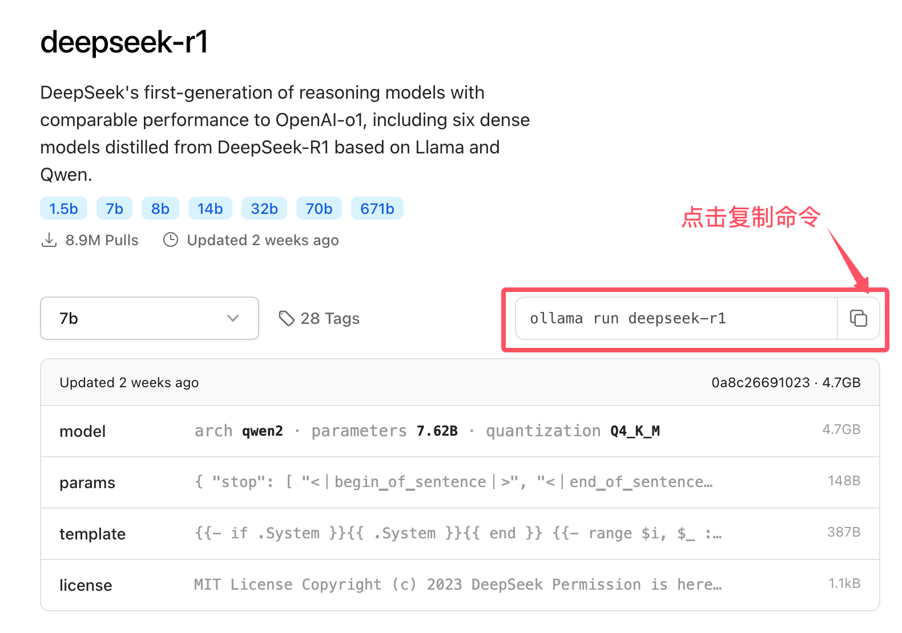

#LLAMAINDEX-RAG 私有化部署RAG实例
- 1.环境配置
- 2.下载Sentence Transformer 模型 
- 3.下载InternLM2 1.8B/qwen2.5_0.5B 模型 
- 4.创建知识库
- 5.创建web应用

# Ollama 基本概念
Ollama 是一个本地化的、支持多种自然语言处理（NLP）任务的机器学习框架，专注于模型加载、推理和生成任务。

通过 Ollama，用户能够方便地与本地部署的大型预训练模型进行交互。

# 1. 模型（Model）
在 Ollama 中，模型是核心组成部分。它们是经过预训练的机器学习模型，能够执行不同的任务，例如文本生成、文本摘要、情感分析、对话生成等。

Ollama 支持多种流行的预训练模型，常见的模型有：

**deepseek-v3** ：深度求索提供的大型语言模型，专门用于文本生成任务。

**LLama2**：Meta 提供的大型语言模型，专门用于文本生成任务。

**GPT**：OpenAI 的 GPT 系列模型，适用于广泛的对话生成、文本推理等任务。

**BERT**：用于句子理解和问答系统的预训练模型。

**其他自定义模型**：用户可以上传自己的自定义模型，并利用 Ollama 进行推理。
模型的主要功能：

**推理（Inference）**：根据用户输入生成输出结果。

**微调（Fine-tuning）**：用户可以在已有模型的基础上使用自己的数据进行训练，从而定制化模型以适应特定的任务或领域。
模型通常是由大量参数构成的神经网络，通过对大量文本数据进行训练，能够学习语言规律并进行高效的推理。

Ollama 支持的模型可以访问：https://ollama.com/library

点击模型，可以查看到下载的命令：

下表列出一些模型的下载命令：

| 模型|	参数	|大小	|下载命令|
| ---- | ---- | ---- | ---- |
| Llama 3.3	| 70B	| 43GB| 	ollama run llama3.3| 
| Llama 3.2	| 3B	| 2.0GB	| ollama run llama3.2| 
| Llama 3.2	| 1B	| 1.3GB	| ollama run llama3.2:1b| 
| Llama 3.2 Vision	| 11B	| 7.9GB	| ollama run llama3.2-vision| 
| Llama 3.2 Vision| 	90B	| 55GB| 	ollama run llama3.2-vision:90b| 
| Llama 3.1	| 8B	| 4.7GB	| ollama run llama3.1| 
| Llama 3.1	| 405B	| 231GB	| ollama run llama3.1:405b| 
| Phi 4	| 14B	| 9.1GB	| ollama run phi4| 
| Phi 3 Mini| 	3.8B	| 2.3GB| 	ollama run phi3| 
| Gemma 2| 	2B	| 1.6GB	| ollama run gemma2:2b| 
| Gemma 2	| 9B	| 5.5GB	| ollama run gemma2| 
| Gemma 2	| 27B| 	16GB	| ollama run gemma2:27b| 
| Mistral	| 7B	| 4.1GB	| ollama run mistral| 
| Moondream 2	| 1.4B	| 829MB	| ollama run moondream| 
| Neural Chat	| 7B	| 4.1GB	| ollama run neural-chat| 
| Starling	| 7B| 4.1GB	| ollama run starling-lm| 
| Code Llama| 	7B	| 3.8GB| 	ollama run codellama| 
| Llama 2 Uncensored| 	7B	| 3.8GB| 	ollama run llama2-uncensored| 
| LLaVA	| 7B	| 4.5GB	| ollama run llava| 
| Solar	| 10.7B	| 6.1GB	| ollama run solar| 

# 2. 任务（Task）
Ollama 支持多种 NLP 任务。每个任务对应模型的不同应用场景，主要包括但不限于以下几种：

**对话生成（Chat Generation）**：通过与用户交互生成自然的对话回复。

**文本生成（Text Generation）**：根据给定的提示生成自然语言文本，例如写文章、生成故事等。

**情感分析（Sentiment Analysis）**：分析给定文本的情感倾向（如正面、负面、中立）。

**文本摘要（Text Summarization）**：将长文本压缩为简洁的摘要。

**翻译（Translation）**：将文本从一种语言翻译成另一种语言。

通过命令行工具，用户可以指定不同的任务，并加载不同的模型来完成特定任务。

# 3. 推理（Inference）
推理是指在已训练的模型上进行输入处理，生成输出的过程。

Ollama 提供了易于使用的命令行工具或 API，使用户可以快速向模型提供输入并获取结果。

推理是 Ollama 的主要功能之一，也是与模型交互的核心。

推理过程：

**输入**：用户向模型提供文本输入，可以是一个问题、提示或者对话内容。
**模型处理**：模型通过内置的神经网络根据输入生成适当的输出。
**输出**：模型返回生成的文本内容，可能是回复、生成的文章、翻译文本等。
Ollama 通过 API 或 CLI 与本地模型交互，能够让用户轻松实现推理任务。

# 4. 微调（Fine-tuning）
微调是指在一个已预训练的模型上，基于特定的领域数据进行进一步的训练，以便使模型在特定任务或领域上表现得更好。

Ollama 支持微调功能，用户可以使用自己的数据集对预训练模型进行微调，来定制模型的输出。

微调过程：

**1 准备数据集** ：用户准备特定领域的数据集，数据格式通常为文本文件或 JSON 格式。

**2 加载预训练模型** ：选择一个适合微调的预训练模型，例如 LLama2 或 GPT 模型。

**3 训练** ：使用用户的特定数据集对模型进行训练，使其能够更好地适应目标任务。

**4 保存和部署**：训练完成后，微调过的模型可以保存并部署，供以后使用。

微调有助于模型在处理特定领域问题时表现得更加精确和高效。

