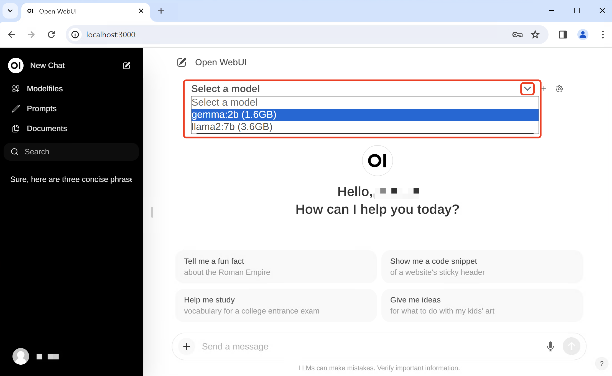

# Ollama Open WebUI
Open WebUI 用户友好的 AI 界面（支持 Ollama、OpenAI API 等）。

Open WebUI 支持多种语言模型运行器（如 Ollama 和 OpenAI 兼容 API），并内置了用于检索增强生成（RAG）的推理引擎，使其成为强大的 AI 部署解决方案。

Open WebUI 可自定义 OpenAI API URL，连接 LMStudio、GroqCloud、Mistral、OpenRouter 等。

Open WebUI 管理员可创建详细的用户角色和权限，确保安全的用户环境，同时提供定制化的用户体验。

Open WebUI 支持桌面、笔记本电脑和移动设备，并提供移动设备上的渐进式 Web 应用（PWA），支持离线访问。

开源地址：https://github.com/open-webui/open-webui

官方文档：https://docs.openwebui.com/

# 安装
Open WebUI 提供多种安装方式，包括通过 Python pip 安装、Docker 安装、Docker Compose、Kustomize 和 Helm 等。

## 使用 Docker 快速开始
如果 Ollama 已安装在你的电脑上，使用以下命令：
```
docker run -d -p 3000:8080 --add-host=host.docker.internal:host-gateway -v open-webui:/app/backend/data --name open-webui --restart always ghcr.io/open-webui/open-webui:main
```
使用 Nvidia GPU 支持运行 Open WebUI：
```
docker run -d -p 3000:8080 --gpus all --add-host=host.docker.internal:host-gateway -v open-webui:/app/backend/data --name open-webui --restart always ghcr.io/open-webui/open-webui:cuda
```
## Open WebUI 与 Ollama 捆绑安装
此安装方法使用一个单一的容器镜像，将 Open WebUI 与 Ollama 捆绑在一起，可以通过一个命令轻松设置。

根据你的硬件配置选择合适的命令。

启用 GPU 支持：
```
docker run -d -p 3000:8080 --gpus=all -v ollama:/root/.ollama -v open-webui:/app/backend/data --name open-webui --restart always ghcr.io/open-webui/open-webui:ollama
```
仅使用 CPU：
```
docker run -d -p 3000:8080 -v ollama:/root/.ollama -v open-webui:/app/backend/data --name open-webui --restart always ghcr.io/open-webui/open-webui:ollama
```
这两个命令都能帮助你简化安装过程，让 Open WebUI 和 Ollama 无缝运行。

安装完成后，你可以通过访问 http://localhost:3000 使用 Open WebUI。



## 更新 Open WebUI
### 手动更新

使用 Watchtower 手动更新 Docker 容器：
```
docker run --rm -v /var/run/docker.sock:/var/run/docker.sock containrrr/watchtower --run-once open-webui
```
### 自动更新

每 5 分钟自动更新容器：
```
docker run -d --name watchtower --restart unless-stopped -v /var/run/docker.sock:/var/run/docker.sock containrrr/watchtower --interval 300 open-webui
```
注意：如果你的容器名不同，请将 open-webui 替换为你的容器名。

# 手动安装
Open WebUI 的安装有两种主要方法：使用 uv runtime manager 或 Python 的 pip。

推荐使用 uv，因为它简化了环境管理，减少了潜在的冲突。

## 使用 uv 安装（推荐）
macOS/Linux：
```shell
curl -LsSf https://astral.sh/uv/install.sh | sh
```
Windows：
```powershell
powershell -ExecutionPolicy ByPass -c "irm https://astral.sh/uv/install.ps1 | iex"
```
### 运行 Open WebUI
安装 UV 后，运行 Open WebUI 就比较简单了。

使用以下命令，确保设置 DATA_DIR 环境变量，以避免数据丢失。

macOS/Linux：
```
DATA_DIR=~/.open-webui uvx --python 3.11 open-webui@latest serve
```
Windows：
```
$env:DATA_DIR="C:\open-webui\data"; uvx --python 3.11 open-webui@latest serve
```
## 通过 pip 安装
Open WebUI 可以通过 Python 的包安装程序 pip 进行安装，在开始安装之前，请确保您使用的是 Python 3.11，以避免可能出现的兼容性问题。

打开您的终端，运行以下命令以安装 Open WebUI：
```
pip install open-webui
```
安装完成后，您可以通过以下命令启动 Open WebUI：
```
open-webui serve
```
启动后，Open WebUI 服务器将运行在 http://localhost:8080，您可以通过浏览器访问该地址来使用 Open WebUI。

