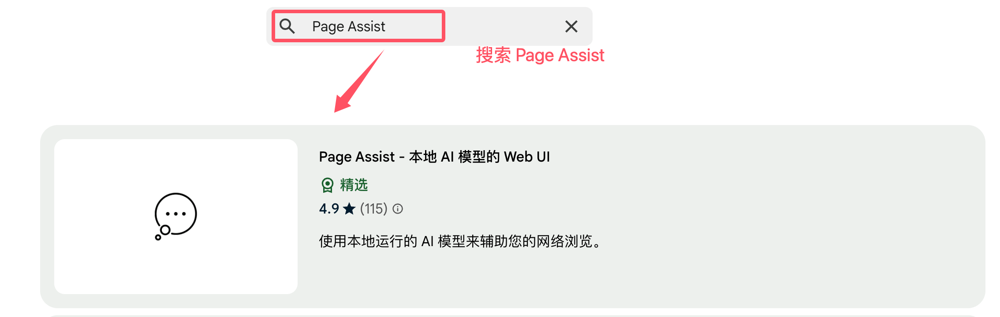
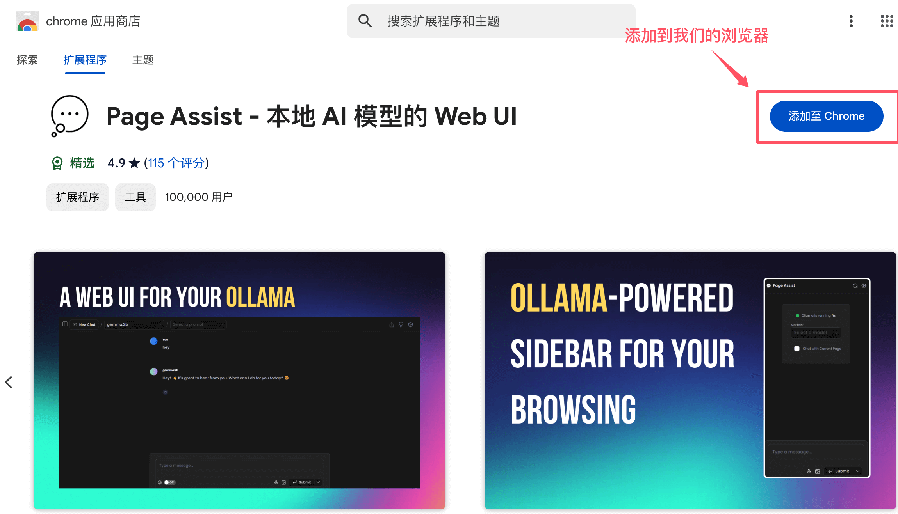
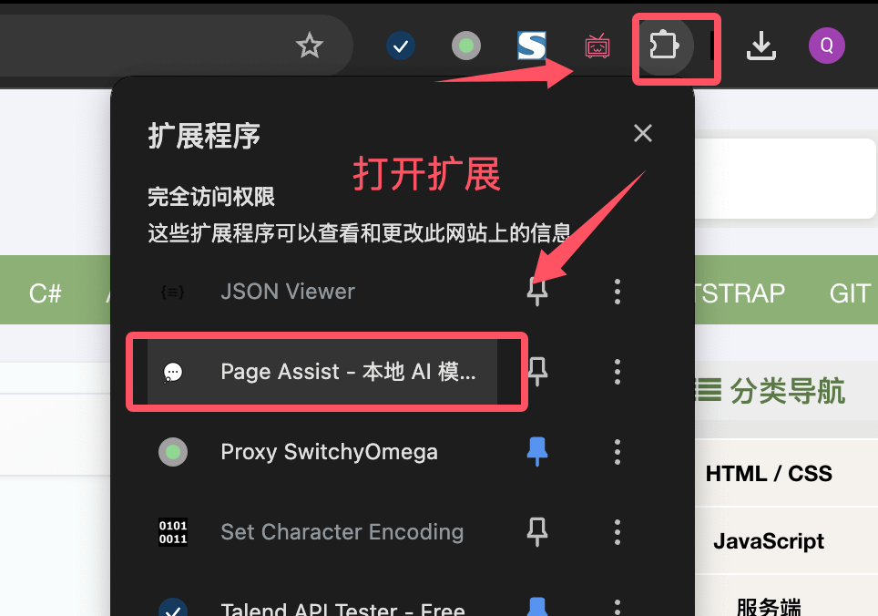
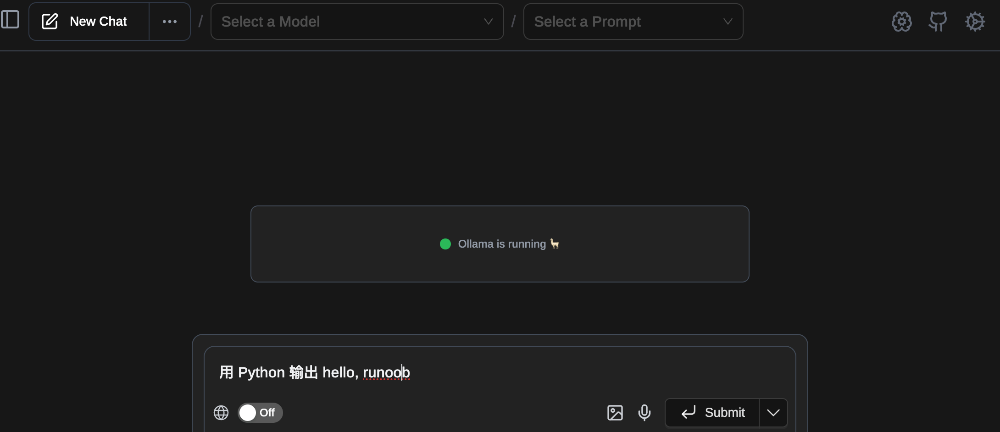
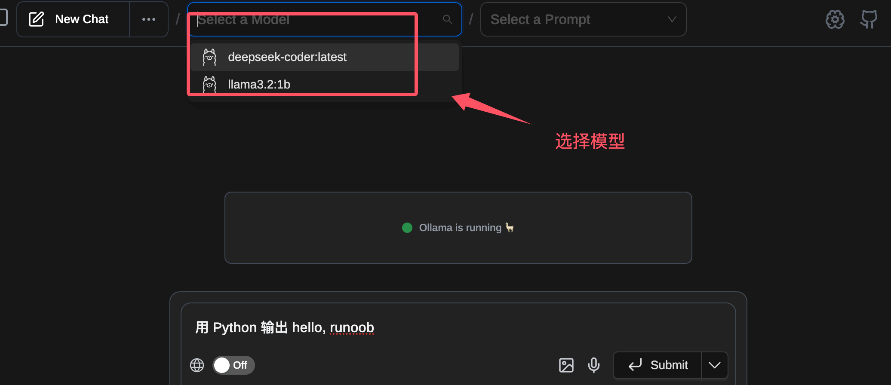
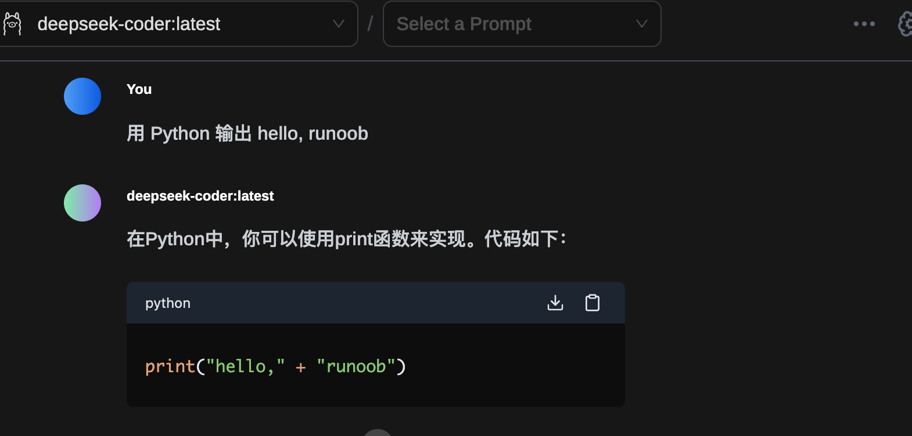
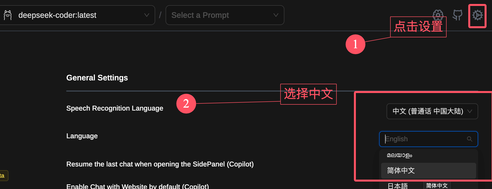
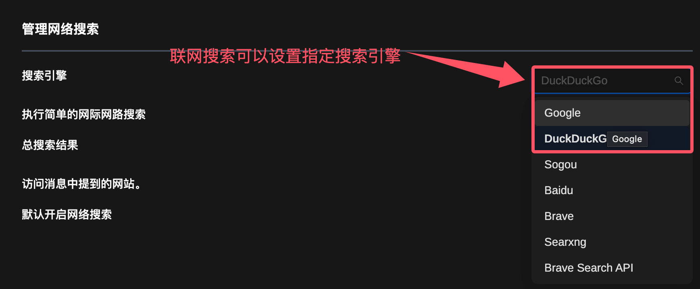

Ollama Page Assist
Page Assist 是一款开源的浏览器扩展程序，主要为本地 AI 模型提供直观的交互界面，让用户可以在任何网页上与本地 AI 模型进行对话和交互。

Page AssistGithub 源代码：https://github.com/n4ze3m/page-assist

## 基本功能
- 侧边栏交互：用户可以在任何网页上打开侧边栏，与本地 AI 模型进行对话，获取与网页内容相关的智能辅助。
- 网页 UI：提供类似 ChatGPT 的网页界面，用户可以在此界面中与 AI 模型进行更全面的对话。
- 网页内容对话：用户可以直接与网页内容进行对话，获取相关信息的解释或分析。
- 多浏览器支持：支持 Chrome、Brave、Edge 和 Firefox 等主流浏览器。
- 快捷键操作：通过快捷键可以快速打开侧边栏和网页 UI，方便用户使用。
- 支持多种本地 AI 提供商：目前支持 Ollama 和 Chrome AI (Gemini Nano) 等本地 AI 提供商。
- 文档解析：支持与 PDF、CSV 等多格式文档进行聊天交流。
- 离线模型适配：适用于离线环境，用户可以在本地运行 AI 模型。
- 隐私保护：所有交互都在本地完成，不会收集用户个人数据，数据存储在浏览器的本地存储中。 开发模式：支持开发者模式，便于进行扩展的开发和测试。

# 安装与使用
我们可以直接从 Chrome Web Store 或 Firefox Add-ons 商店下载安装，也可以通过手动安装的方式进行。

访问 https://chromewebstore.google.com/search/，搜索 Page Assist：

也可以直接点击扩展链接： https://chromewebstore.google.com/detail/page-assist-%E6%9C%AC%E5%9C%B0-ai-%E6%A8%A1%E5%9E%8B%E7%9A%84-web/jfgfiigpkhlkbnfnbobbkinehhfdhndo 。

点击添加按钮：

安装完成后，用户可以通过右上角的扩展小标志打开它：

打开后就可以看到 Ollama 正在运行的提示，如果还没启动则需要启动 Ollama：

接下来我们可以选择指定的模型，然后输入提示词：

效果如下所示：

界面是英文看不懂，没事，点击右上角的齿轮，可以设置成中文：

联网搜索功能，也可以修改默认搜索引擎：

Page AssistGithub 源代码：https://github.com/n4ze3m/page-assist

